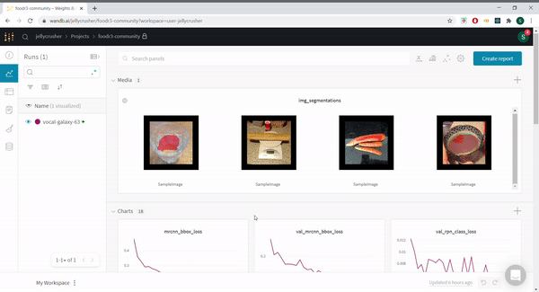

## Intro

Mask R-CNN is a deep learning model for computer vision developed by the Facebook AI group that achieves state-of-the-art results on semantic segmentation (object recognition and pixel labeling) tasks. An implementation of the model is made available by Matterport on their [github page](github.com/matterport). The code in their repo works with MS Coco (a benchmark dataset for semantic segmentation) out of the box, but provides for easy extensibility to any kind of dataset or image segmentation task.

This fork of the [matterport/mask_rcnn repo](github.com/matterport/mask-rcnn) was set up to integrate with Weights and Biases (wandb). wandb is a cloud interface for tracking model parameters and performance, allowing machine learning teams to coordinate work in a way similar to github.

We customised this repo to work with a custom dataset, particularly the Food Recognition Challenge Dataset for the competition hosted on AICrowd.

[Here](https://wandb.ai/jellycrusher/foodr3-community) are the results of our runs.

For a more detailed overview of our process and results see our [discourse post](https://discourse.aicrowd.com/t/maskrcnn-integrated-with-wandb-and-direct-submit-from-colab/3961) on aicrowd or the
"What's on my plate? notebook present [here](https://colab.research.google.com/drive/1D8jC9GdHhCyoGB-8bJogW-lSO21MeTKF?usp=sharing) (Runs on colab!).

There is also a submission repo which you can use to submit models created with appropriate changes made to the config file present in the eval.py file. This repo is accessible [here](https://gitlab.aicrowd.com/shraddhaa_mohan/foodr3-community)

## Setup

To run this experiment locally create a conda environment named tf-maskrcnn

1. `source activate tf_maskrcnn`
2. `git clone https://github.com/shraddhaamohan/MaskRCNN_wandb.git`
3. `cd MaskRCNN_wandb`
4. `pip install cython`
5. `pip install -r requirements.txt`
6. `python setup.py install`
7. `cd data`
   `python create_small.py`
   `cd ..`
   (create annotations-small.json for train and val)
8. `wandb init`, then follow the init steps
9. `python samples/food/food.py train --model=coco --dataset=path_to_data_dir`

The parameter sweep can be run with `./sweep.sh`
